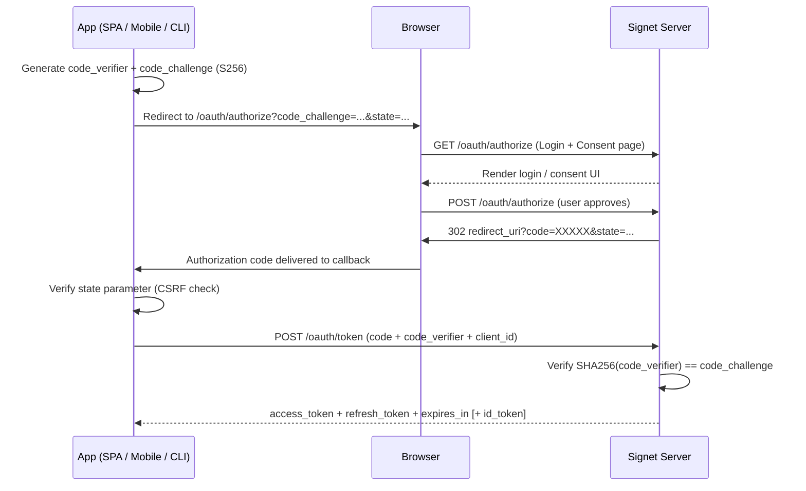
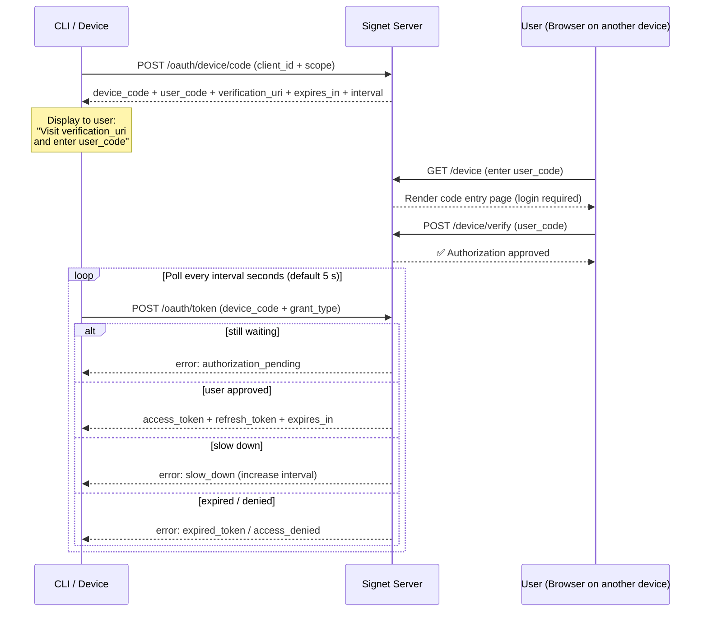
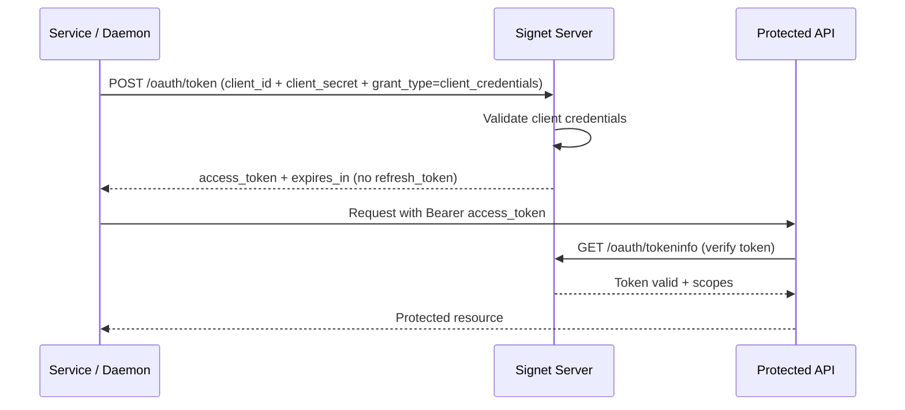
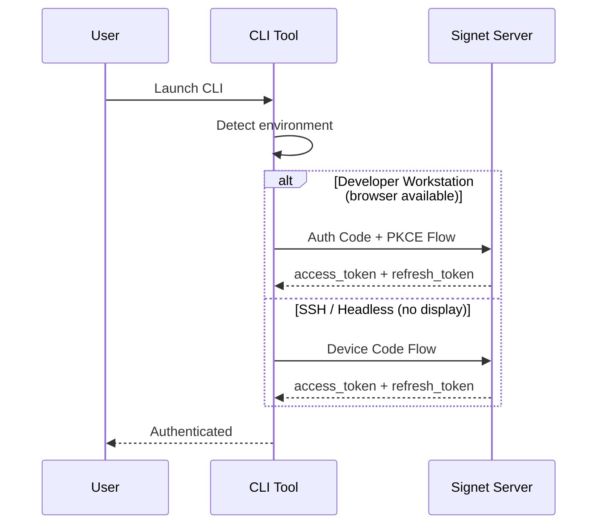
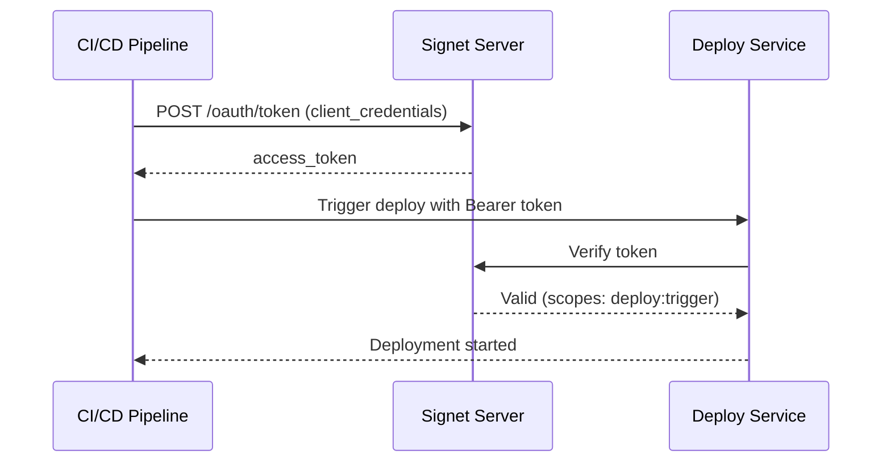
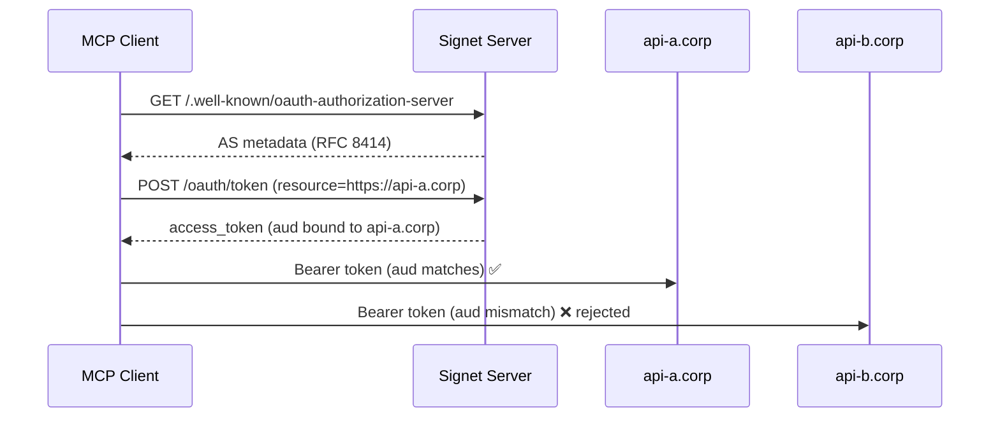
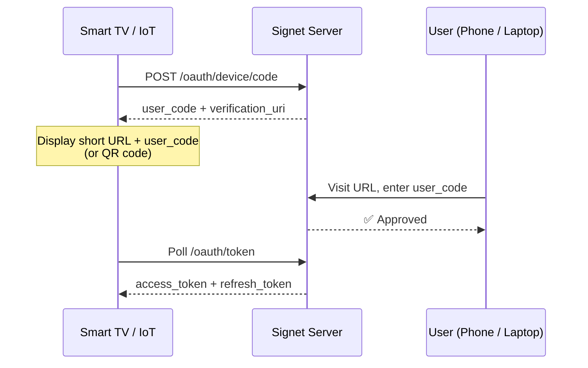
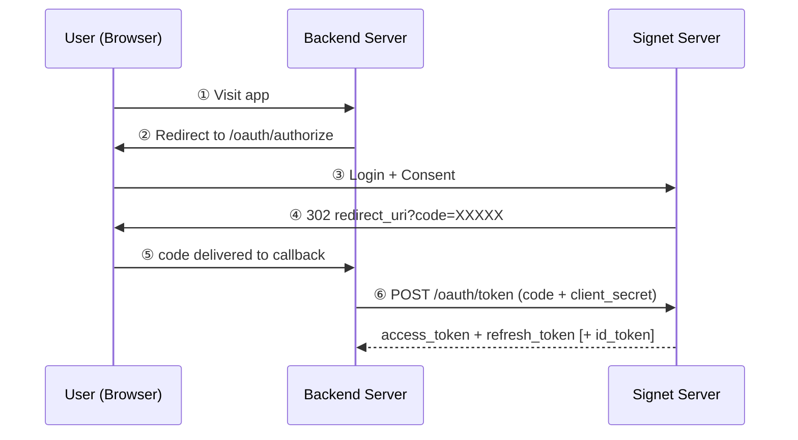
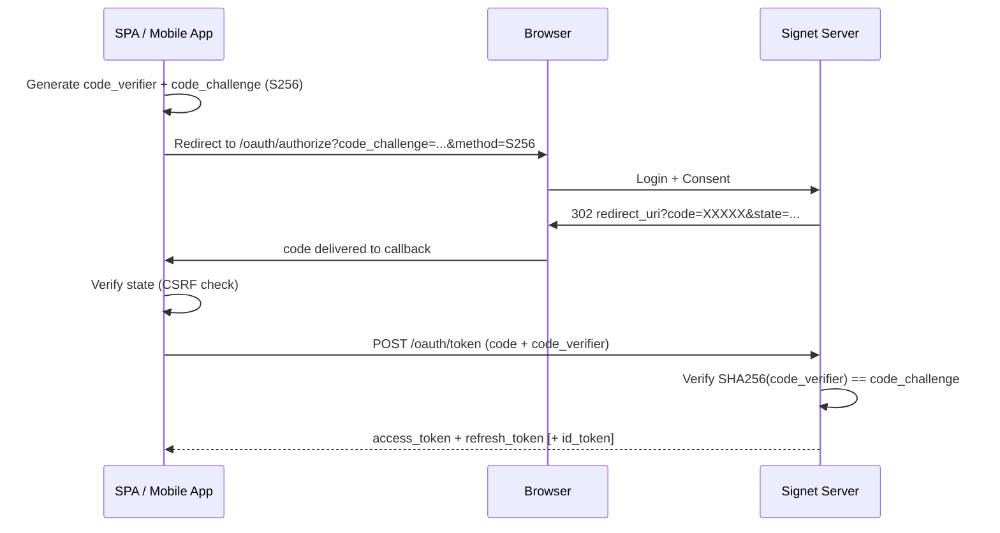

  <picture>
    <source media="(prefers-color-scheme: dark)" srcset="https://raw.githubusercontent.com/go-signet/brand/main/logo-dark.svg">
    
  </picture>

# go-signet

**Signet** is a production-ready OAuth 2.0 / OIDC toolkit for Go — covering the **Authorization Server**, **Go & Python SDKs** for secure token storage and validation, and a **Helm chart** for Kubernetes. MCP-ready out of the box with Resource Indicators (RFC 8707) and AS Metadata (RFC 8414).

> A signet ring stays with its owner — pressing it into wax produces a mark anyone can verify but nobody else can make. The ring is the private key you hold; the impression is the verifiable signature it stamps onto every token.

---

## Supported OAuth 2.0 Flows

### 1. Authorization Code Flow + PKCE (RFC 6749 + RFC 7636)

Designed for web apps, SPAs, and mobile apps. PKCE replaces client secrets for public clients, preventing authorization code interception. Issues an `id_token` (OIDC) when the `openid` scope is granted.

**Security properties:**

- PKCE (RFC 7636) with S256 enforced — `plain` is rejected; prevents authorization code interception attacks
- `state` parameter — CSRF protection on the callback
- No client secret required for public clients (SPA, mobile, CLI)
- Callback server binds to `127.0.0.1` only (CLI mode)

---

### 2. Device Authorization Grant (RFC 8628)

Designed for CLI tools, IoT devices, and headless environments where a browser is not available.

**Polling behavior:**

- Respects server-specified interval (default 5 s)
- Exponential backoff on `slow_down` response (up to 60 s, per RFC 8628)
- Device codes expire after 30 minutes
- Resource-bound device codes (RFC 8707) always route through an explicit confirmation screen before authorization

---

### 3. Client Credentials Grant (RFC 6749 Section 4.4)

Designed for microservices, daemons, and CI/CD pipelines — machine-to-machine authentication where no user is involved.

**Key characteristics:**

- No user interaction — the client authenticates with its own credentials
- Requires **confidential clients** (client_secret must be securely stored server-side)
- No refresh tokens issued — the client requests a new token when the current one expires
- Scoped access — tokens carry only the scopes assigned to the client (`openid` and `offline_access` are not permitted)

---

## Use Cases

### CLI Tools

One binary, two flows, zero configuration — mirrors the strategy used by **GitHub CLI**, **Azure CLI**, and **Google Cloud SDK**.

---

### Microservices & CI/CD

Service-to-service authentication — no user context needed, no browser involved.

---

### MCP & Multi-Resource APIs

A single Signet server fronts multiple resource servers; each token's audience is bound at issuance and cannot be replayed elsewhere.

**Hardening:** Every bearer token carries a `type` claim, so a refresh token can never be accepted as an access token. Resource-bound device codes require explicit user confirmation of the client and target resource.

---

### IoT & Smart Devices

No keyboard, no embedded secret — the user authorizes from any nearby device.

---

### Web Applications (Confidential Client)

Server-side backend holds the client secret; it is never exposed to the browser.

---

### Single-Page Apps & Mobile (Public Client + PKCE)

No client secret on device — PKCE binds the token exchange to the original requestor.

---

## Which Flow Should I Use?

| Scenario                                | Recommended Flow                                   |
| --------------------------------------- | -------------------------------------------------- |
| CLI tools, IoT devices, TV apps         | **Device Code Flow** (RFC 8628)                    |
| Web apps with a server-side backend     | **Authorization Code Flow** (confidential client)  |
| Single-page apps (SPA), mobile apps     | **Authorization Code Flow + PKCE** (public client) |
| Microservices, daemons, CI/CD pipelines | **Client Credentials Grant** (RFC 6749 §4.4)       |
| MCP servers, multi-resource APIs        | **Any grant + `resource` parameter** (RFC 8707)    |

---

## Brand

The Signet identity — a **signet ring** with an octagonal bezel and a carved "S" — lives in the [`brand`](https://github.com/go-signet/brand) repository, with logos, marks, favicons, the color palette, and usage rules. Browse the interactive guidelines at [go-signet.github.io/brand](https://go-signet.github.io/brand/).

---

## References

- [RFC 6749 — OAuth 2.0 Authorization Framework](https://datatracker.ietf.org/doc/html/rfc6749)
- [RFC 6749 §4.4 — Client Credentials Grant](https://datatracker.ietf.org/doc/html/rfc6749#section-4.4)
- [RFC 7636 — PKCE for OAuth Public Clients](https://datatracker.ietf.org/doc/html/rfc7636)
- [RFC 7009 — OAuth 2.0 Token Revocation](https://datatracker.ietf.org/doc/html/rfc7009)
- [RFC 7591 — OAuth 2.0 Dynamic Client Registration](https://datatracker.ietf.org/doc/html/rfc7591)
- [RFC 7662 — OAuth 2.0 Token Introspection](https://datatracker.ietf.org/doc/html/rfc7662)
- [RFC 8414 — OAuth 2.0 Authorization Server Metadata](https://datatracker.ietf.org/doc/html/rfc8414)
- [RFC 8628 — OAuth 2.0 Device Authorization Grant](https://datatracker.ietf.org/doc/html/rfc8628)
- [RFC 8707 — Resource Indicators for OAuth 2.0](https://datatracker.ietf.org/doc/html/rfc8707)
- [RFC 8725 — JWT Best Practices](https://datatracker.ietf.org/doc/html/rfc8725)
- [RFC 9700 — Best Current Practice for OAuth 2.0 Security](https://datatracker.ietf.org/doc/html/rfc9700)
- [OpenID Connect Core 1.0](https://openid.net/specs/openid-connect-core-1_0.html)
- [Model Context Protocol Specification](https://modelcontextprotocol.io/specification/2025-06-18/basic/authorization)
